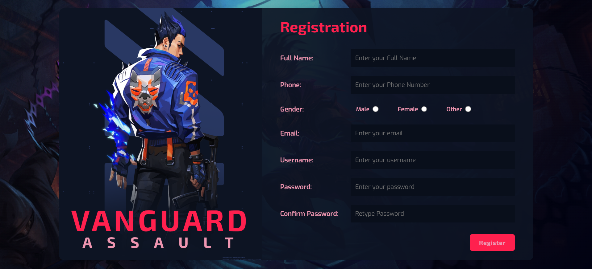
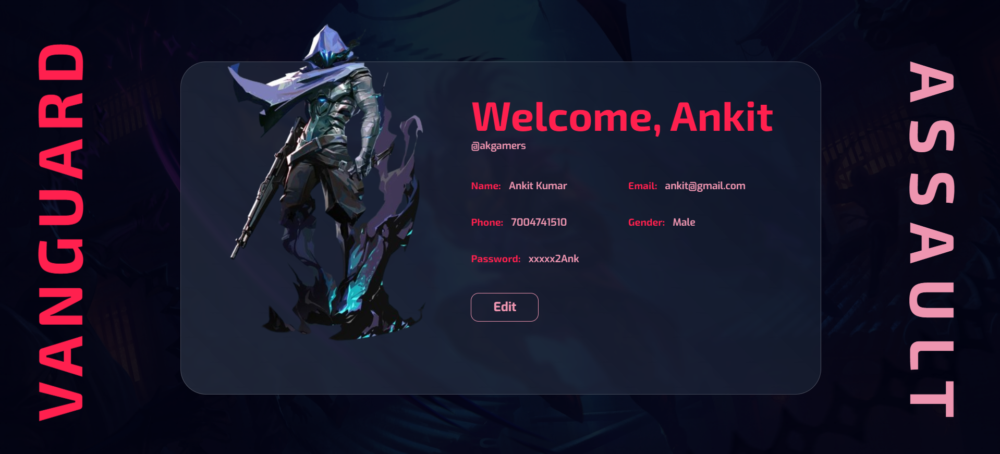

# gamingForm

Welcome to the gaming form page of my project! This project showcases a well-designed registration page created using HTML,CSS and JS. The design includes animations and form validation.

## Features

- Form Validations.
- Animations on form input field when user type any wrong key.


## Screenshot

To enhance the aesthetics of this page, I have incorporated a screenshot. You can find the screenshot in the "assets/screenshot" directory of this repository.





## Instructions

1. Clone the repository:

   ```bash
   git clone https://github.com/superiorankit/gamingForm.git
   cd ./gamingForm

- Open index.html file
